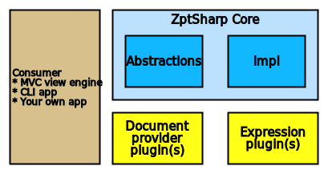

# ZptSharp architecture
The following diagram shows the architecture of a complete application which uses ZptSharp.

The consuming application must add ZptSharp to its `IServiceCollection` (dependency injection) during **Startup**, as well as perform a few one-time configuration/registration tasks.

Once ZptSharp is set up, a project which makes use of it need only take a direct reference to the ZptSharp package. Consuming projects need not reference the other packages, because all of ZptSharp's functionality is available by injecting interfaces.

## The ZptSharp package
The NuGet package ZptSharp contains only abstractions, model types and the API. In particular it contains the [`IRendersZptFile`] & [`IRendersZptDocument`] interfaces which are the two primary entry-points to the functionality.

This package's dependencies have been kept to a minimum, so that it is as easy as possible to consume.

This package forms one half of "The ZptSharp core".

[`IRendersZptFile`]: xref:ZptSharp.IRendersZptFile
[`IRendersZptDocument`]: xref:ZptSharp.IRendersZptDocument

## The ZptSharp.Impl package
The ZptSharp.Impl NuGet package contains the main logic and implementation classes for almost all of the abstractions declared in the ZptSharp package.

This package is the other half of "The ZptSharp core".

ZptSharp.Impl includes the following **expression evaluators** (see below).

* `path`
* `string`
* `not`
* `pipe`

## Document providers
_In order to have a working ZptSharp implementation, you **must** install at least one document provider packages. The two core packages alone are not enough._

Document providers are the way in which ZptSharp reads and writes markup documents (HTML and/or XML). The main interface which must be implemented by a document provider is [`IReadsAndWritesDocument`]. They bridge the gap between the ZptSharp core packages and the DOM.

ZptSharp has three document provider packages available:

| Package                  | Description |
| -------                  | ----------- |
| ZptSharp.Xml             | Reads/writes XML documents using the `System.Xml.Linq` API |
| ZptSharp.HtmlAgilityPack | Reads/writes HTML documents using the HTML Agility Pack |
| ZptSharp.AngleSharp      | Reads/writes HTML documents using AngleSharp |

[`IReadsAndWritesDocument`]: xref:ZptSharp.Dom.IReadsAndWritesDocument

## Expression evaluators
An expression evaluator provides support for one or more TALES expression types. _Unlike document providers_, the core packages include support for a few expression types, which may be sufficient for your application. _Installing additional evaluators is optional_.

The main interface which an expression evaluator must implement is [`IEvaluatesExpression`].

The available expression evaluator add-on packages are:

| Package | Description |
| ------- | ----------- |
| ZptSharp.PythonExpressions | Evaluates expressions written in Python 2 (via IronPython) |
| ZptSharp.CSharpExpressions | Evaluates expressions written in C# (via Roslyn scripting API) |

[`IEvaluatesExpression`]: xref:ZptSharp.Expressions.IEvaluatesExpression